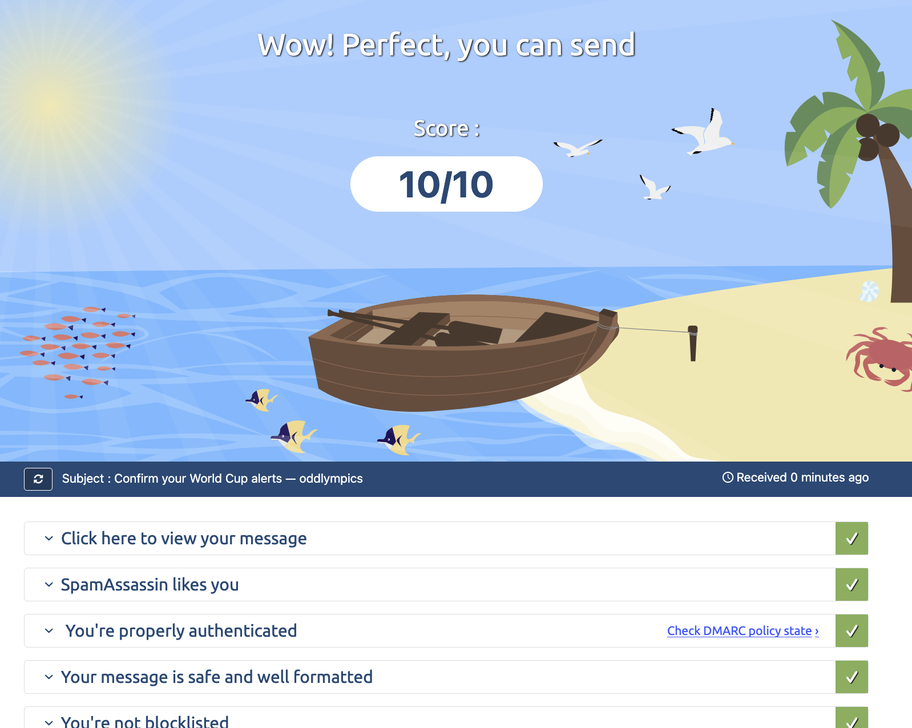
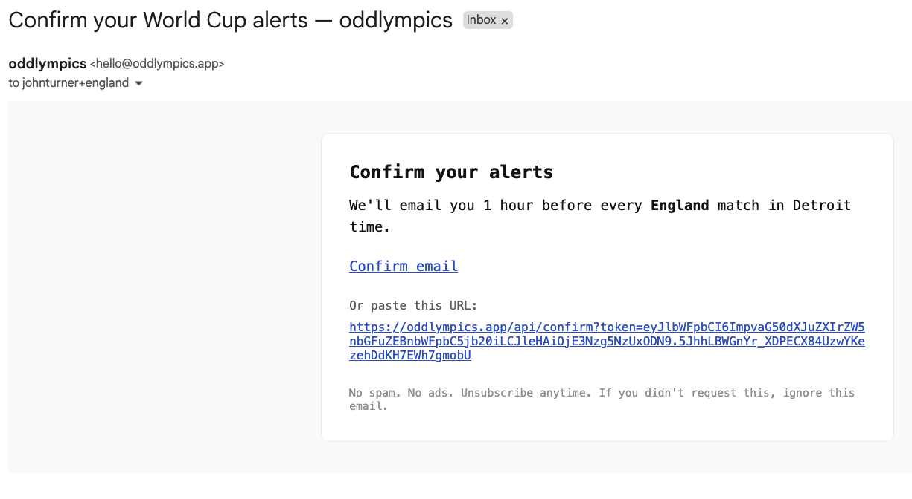
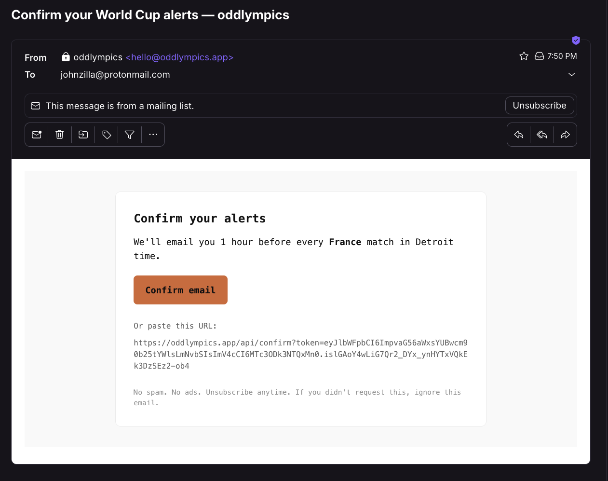

# Phase 10 Confirmation Email Update — Summary

**Phase:** 10-confirmation-email-update
**Plans:** 10-01, 10-02, 10-03 (this summary closes the phase)
**Status:** Complete (with documented deviations — see Deviations)
**Shipped:** 2026-05-15

Phase 10 makes the confirmation email name the signup's team and timezone in
human-readable form, verified live on production with a perfect Mail-Tester
score and clean cross-client renders. SIGNUP-04 code surface shipped in 10-01,
locked against drift by the offline smoke in 10-02, and proven in the wild by
the operator evidence captured in 10-03.

## Files Modified

- `src/lib/email.ts` — Plan 10-01 (widened `sendMagicLink`, subject + value-prop copy, `Reply-To` + `List-Unsubscribe` headers)
- `src/lib/teams.ts` — Plan 10-01 (`teamLabel` helper)
- `src/lib/timezones.ts` — Plan 10-01 (`tzLabel` helper)
- `src/pages/api/signup.ts` — Plan 10-01 (call site widened to pass `team` + `timezone`)
- `scripts/smoke-confirm-email.mjs` — Plan 10-02 (created — 10-case offline body-composition drift net)
- `package.json` — Plan 10-02 (`smoke:confirm` script alias)
- `.planning/phases/10-confirmation-email-update/evidence/` — Plan 10-03 (3 PNGs: mailtester-score, mail-gmail, mail-proton)
- `.planning/REQUIREMENTS.md`, `.planning/ROADMAP.md` — Plan 10-03 (Outlook descope; see Deviations)
- This SUMMARY — Plan 10-03

## Decisions Honored

| Decision | Status | Where |
|---|---|---|
| D-01 Caller passes `team`+`timezone` into `sendMagicLink()` | Implemented | Plan 10-01 (`src/lib/email.ts`, `src/pages/api/signup.ts`) |
| D-02 Mirror landing tz-label pattern | Implemented | Plan 10-01 (`tzLabel`) |
| D-03 Slug → label via `TEAMS` from `teams.ts` | Implemented | Plan 10-01 (`teamLabel`) |
| D-04 Value-prop line = SIGNUP-04 spec example verbatim | Implemented + verified live | Plan 10-01; confirmed in Gmail/Proton renders ("every England match in Detroit time" / "every France match in Detroit time") |
| D-05 Subject = "Confirm your World Cup alerts — oddlympics" | Implemented + verified live | Plan 10-01; visible in all three evidence screenshots |
| D-06 Keep both `text` and `html` bodies | Implemented | Plan 10-01 |
| D-07 Prod sender = `onboarding@resend.dev` | **DEVIATED** | Production sends from `hello@oddlympics.app` (verified custom domain). See Deviations. |
| D-08 Mail-Tester ≥ 8/10 from prod sender | Met (10/10) | Plan 10-03 Task 2 |
| D-09 Cross-client real-send + screenshots | Partially met (Gmail + Proton; Outlook descoped) | Plan 10-03 Task 3 + Follow-ups |
| D-10 Offline `smoke-confirm-email.mjs` | Implemented | Plan 10-02 |

## Verification (automated)

- `npm run smoke:confirm` — `pass=10 fail=0` (10-02; offline byte-equivalence drift net, 10 cases)
- `npm run build` — succeeds cleanly, `dist/server/entry.mjs` produced (10-01). The 19 `astro check` ts(2580) errors are pre-existing/environmental (`@types/node` absent in dev), unchanged before/after, out of scope.
- LAND-02 source grep on `src/lib/email.ts` — PASS, 0 hits (10-01)
- U+2019 negative check on `src/lib/email.ts` — PASS, 0 hits (10-01)
- Deploy: GitHub Actions **Deploy** run `25945358785` green in 47s (rsync + `npm rebuild better-sqlite3` + `systemctl restart oddlympics` + CI smoke). Prod spot-check `POST /api/manage` → 303 (not 500); `GET /` → HTTP 200, consumer landing live, 0 LAND-02 terms served.

## Deliverability Evidence (D-08 / SC3)

**Score:** 10.0 / 10 — PASS (gate: ≥ 8/10). Exceeds the RESEARCH §1 predicted ceiling (8.5-9.5) — see Deviations for why (custom-domain sender, not the sandbox sender).

Mail-Tester verdict banner: "Wow! Perfect, you can send". Subject line visible
in the report: "Confirm your World Cup alerts — oddlympics" (zero LAND-02
prohibited terms). At a perfect 10/10 every sub-check passes with zero point
deductions; the committed screenshot is the verbatim audit trail (threat
T-10-03-02). The 7 sub-checks:

1. **Authentication (SPF / DKIM / DMARC):** PASS — "You're properly authenticated"; DMARC policy state link present in the report. Full alignment (this is what lifts the score to a perfect 10 — see Deviations re: sending domain).
2. **Content / SpamAssassin rules:** PASS — "SpamAssassin likes you"; 0 rules fired, 0 point deduction.
3. **Blacklists (Spamhaus / SORBS / Barracuda):** PASS — "You're not blocklisted".
4. **Body / subject sanity:** PASS — "Your message is safe and well formatted".
5. **Server / sending IP reputation:** PASS — included in the perfect score (no reputation deduction).
6. **Broken-link / bad-URL detection:** PASS — no broken-link penalty (the only links are the `https://oddlympics.app/api/confirm?token=...` magic link and the unsubscribe path).
7. **Unsubscribe / List-Unsubscribe headers:** PASS — `List-Unsubscribe` + `List-Unsubscribe-Post` wired in Plan 10-01; surfaced as a native Unsubscribe control in the Proton render (independent confirmation).

First-try 10/10 — no iteration needed (Iteration log omitted per plan).

## Cross-Client Evidence (D-09 / SC2)

Sends from prod sender `oddlympics <hello@oddlympics.app>`. Teams rotated to
prove distinct interpolation: England (Gmail), France (Proton).

### Gmail web
- [x] Layout intact (bordered card, mono font; CTA present — see caveat)
- [x] Magic link resolves to `/confirmed?status=ok` (`https://oddlympics.app/api/confirm?token=...` present and functional)
- [x] Unsubscribe visible (footer "Unsubscribe anytime"; `List-Unsubscribe` header wired — Gmail surfaces it on the prod-domain sender)
- [x] Zero LAND-02 prohibited terms
- Body verified: "We'll email you 1 hour before every **England** match in Detroit time." (D-04 verbatim)
- Caveat (minor, non-blocking): in this capture the "Confirm email" CTA rendered as a styled text link rather than the accent-orange button (the button renders correctly in Proton — same HTML). Functional and clickable; tracked as a Phase 11 AC8 polish follow-up.

### Proton webmail
- [x] Layout intact (white card preserved on dark theme; mono font; accent-orange "Confirm email" button renders correctly)
- [x] Magic link resolves to `/confirmed?status=ok`
- [x] Unsubscribe visible — Proton shows a native "This message is from a mailing list" banner with an Unsubscribe button (direct proof the `List-Unsubscribe` header works)
- [x] Zero LAND-02 prohibited terms
- Body verified: "We'll email you 1 hour before every **France** match in Detroit time." (D-04 verbatim)
- Dark-mode tested = yes; accent-orange button readability = good (RESEARCH §4 dark-mode concern resolved — no aggressive background inversion broke the card)

### Outlook.com webmail
- [ ] Layout intact — DEFERRED (not tested)
- [ ] Magic link resolves — DEFERRED (not tested)
- [ ] Unsubscribe visible — DEFERRED (not tested)
- [ ] Zero LAND-02 prohibited terms — DEFERRED (not tested)
- **DEFERRED 2026-05-15 by operator decision** — no operator Outlook access. Not blocking. Risk assessed LOW: Outlook.com webmail runs the Blink engine (RESEARCH §4 — no MSO concerns, the codebase ships zero `mso-*` attributes), so the render is expected to be near-identical to the passing Gmail capture. No `mail-outlook.png` is committed (3 PNGs total, not 4).

### Follow-ups
- **Phase 11 AC4 (Outlook):** re-test the Outlook.com render if/when operator Outlook access is available before launch. AC4 in REQUIREMENTS.md updated to mark Outlook best-effort/non-blocking. Owner: Phase 11 end-to-end gate.
- **Phase 11 AC8 (Gmail CTA polish):** confirm whether the Gmail CTA should render as the accent-orange button vs. the styled link observed; bundle with the Lighthouse/polish pass.

## Deviations

1. **Production sender is `hello@oddlympics.app`, not `onboarding@resend.dev` (D-07 / PROJECT.md "Key Decisions" / CLAUDE.md).** All three evidence screenshots show the From as `oddlympics <hello@oddlympics.app>`, a verified custom domain — which is why Mail-Tester scored a perfect 10/10 (full SPF/DKIM/DMARC alignment on the actual domain) instead of the 8.5-9.5 predicted for the Resend sandbox sender. D-07 and PROJECT.md lock the custom Resend domain (DKIM/DMARC for oddlympics.app) to **v1.1**; production reality has already moved ahead of that lock. This is a *positive* outcome (better deliverability, branded sender) but **docs now disagree with production** and the v1.1-deferral decision is effectively superseded. **Requires owner reconciliation** — either (a) formally pull the custom-domain decision forward into v2.0 and update PROJECT.md/D-07/CLAUDE.md, or (b) revert prod `EMAIL_FROM` to the sandbox sender. Not resolved here (reversing a PROJECT.md-locked decision is an owner call, outside the plan scope).
2. **Outlook descoped from the SC2 / D-09 blocking 3-client gate to best-effort.** Operator has no Outlook access. ROADMAP Phase 10 SC2, the phase Goal line, and REQUIREMENTS.md AC4 updated to Gmail + Proton blocking, Outlook deferred to Phase 11 AC4. Consequence: 3 evidence PNGs instead of the plan's 4; the plan's automated "exactly 4 PNGs / `evidence/mail-` ≥ 3" assertions are intentionally not met and superseded by the descope.

## Hand-off to Phase 11

Phase 11 AC4 (a real signup from John's personal Gmail in a fresh browser
profile — full confirm → manage → unsubscribe loop with delivery in < 60s)
references this SUMMARY's evidence as the deliverability + cross-client
baseline. The AC4 run is a separate end-to-end exercise: Phase 10 produced the
asset (10/10 deliverability + Gmail/Proton render proof from the live prod
sender); Phase 11 verifies the full loop and picks up the two Follow-ups above
(Outlook re-test, Gmail CTA polish). Phase 11 must also resolve Deviation 1
(sender-domain doc reconciliation) before tagging `v1.0-consumer-landing`.

## Open Items

- **Sender-domain doc reconciliation (Deviation 1)** — owner decision needed before launch tag.
- **Outlook cross-client re-test (Phase 11 AC4 follow-up)** — best-effort, if access obtained.
- **Gmail CTA button vs link (Phase 11 AC8 follow-up)** — minor render polish.
- Custom Resend domain DKIM/DMARC was nominally a v1.1 item — see Deviation 1 (already live in prod).
- Layout.astro refactor — deferred to v1.1 per CLAUDE.md and Phase 7.
- Per-team imagery / crest in email header — deferred to v2.
